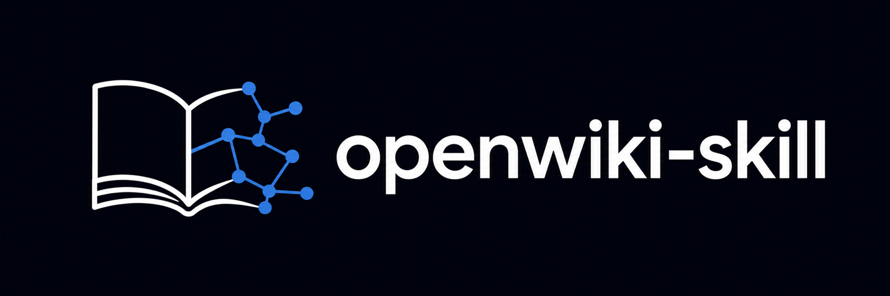

<!-- markdownlint-disable MD033 MD041 -->

<div align="center">



### The self-maintaining wiki, as agent skills.

[](https://skills.sh/JHSeo-git/openwiki-skill)

</div>

Write, maintain, and answer from OpenWiki wikis — repository documentation in `openwiki/` and a personal knowledge wiki in `~/.openwiki/wiki` — a port of [langchain-ai/openwiki](https://github.com/langchain-ai/openwiki) v0.3.2 for coding agents like Claude Code and Codex.

The upstream CLI drives an LLM through provider APIs. This port drops that plumbing: your coding agent already *is* the LLM, with filesystem and git tools attached, so it executes the same workflow directly — the upstream system prompts are reproduced verbatim inside the skills, with harness differences marked `[adapted]`. No API key, no runtime, no configuration.

**openwiki-skill gives you:**

- **Agent-written repo docs that stay accurate** — init builds a complete, QA-verified wiki; update makes surgical, impact-plan-driven edits and no-ops cleanly when nothing relevant changed.
- **A personal knowledge wiki** fed by your own sources — MCP servers, web search, local repos — instead of upstream's OAuth connectors.
- **Wiki-first Q&A** that answers from either wiki, citing pages and their inline source references.
- **Open Knowledge Format** ([OKF v0.1](https://github.com/GoogleCloudPlatform/knowledge-catalog/blob/main/okf/SPEC.md)) output: YAML front matter on every concept page (only `type` required; producer extensions preserved), an evidence-backed concept graph, deterministically generated `index.md` per directory, and automatic normalization of non-compliant pages — wikis stay interoperable with the upstream CLI, so either tool can continue a wiki the other started.
- **Validated rendering after every run** — broken Mermaid fences degrade to text fences instead of breaking the page, and broken internal links or heading anchors are stamped in place for the next update to repair.
- **Multilingual wikis** (BCP-47): the output language persists in run metadata, index headings localize, and switching it retranslates the whole wiki.
- **`.openwikiignore`** — a gitignore-style read boundary for repository runs: matching paths are never read, scanned, or documented.
- **Keyless scheduled updates** via local cron or a cloud routine under your subscription, plus CI templates for the API-key route.

## Quick start

```sh
npx skills add JHSeo-git/openwiki-skill
```

Or manually: copy `skills/openwiki/`, `skills/openwiki-personal/`, `skills/openwiki-ask/`, and `skills/mermaid-diagrams/` into your agent's skills directory, e.g. `~/.claude/skills/` for Claude Code. (If you installed the `migrate-wiki-to-okf` skill from v0.2.0, remove it — upstream 0.2.1 replaced it with an automatic normalization pass inside the wiki skills.)

Then ask your agent:

> Generate documentation for this repository

The first run initializes `openwiki/`: a `quickstart.md` entrypoint with a task-routing table, focused section pages, the upstream marker snippet (`<!-- OPENWIKI:START/END -->`) in root `AGENTS.md` and `CLAUDE.md`, and run metadata in `openwiki/.last-update.json`. Keep it current by asking "Update the wiki" — or schedule it (see [Automation](#automation)).

## Skills

| Skill | What it does |
|---|---|
| [`openwiki`](skills/openwiki/SKILL.md) | Generate (init) or surgically refresh (update) a repo's `openwiki/` wiki — upstream's code mode. Auto-detects the mode; manages the marker snippet in root `AGENTS.md` and `CLAUDE.md`. |
| [`openwiki-personal`](skills/openwiki-personal/SKILL.md) | Build or maintain the personal knowledge wiki at `~/.openwiki/wiki` — upstream's personal mode. Per-source wiring guidance: [`references/connectors.md`](skills/openwiki-personal/references/connectors.md). |
| [`openwiki-ask`](skills/openwiki-ask/SKILL.md) | Answer questions from either wiki, wiki-first, citing pages. |
| [`mermaid-diagrams`](skills/mermaid-diagrams/SKILL.md) | Diagram-type choices and Mermaid syntax-safety rules the wiki skills consult when embedding diagrams — upstream's bundled skill. |

## Use

- "Update the wiki" → surgical update driven by a docs impact plan over the git range since the last documented commit; no-ops cleanly (early git check + content-hash check) when nothing relevant changed.
- "Migrate the wiki to OKF" → just run an update: every run starts by normalizing non-compliant pages (minimal `type`/`title` front matter flagged `openwiki_generated: true`, bodies untouched), then enriches the flagged pages it works on.
- "Switch the wiki to Korean" → an update that retranslates every page (front matter titles/descriptions included, code identifiers untouched), localizes index headings, and persists the language so later runs keep writing in it.
- "Fold our LangSmith traces into the wiki" → a repo update run following [`references/runtime-evidence.md`](skills/openwiki/references/runtime-evidence.md): anomaly-weighted trace sampling synthesized into a `runtime-behavior.md` page plus the code pages it concerns.
- "How does X work?" → `openwiki-ask` answers from the wiki, citing pages and their inline source references.
- "Set up my personal wiki" / "pull today's Slack into my wiki" → `openwiki-personal` initializes or source-updates `~/.openwiki/wiki`.
- Steer either wiki with a brief: a user-authored `openwiki/INSTRUCTIONS.md` (repo) or `~/.openwiki/INSTRUCTIONS.md` (personal) is read into every run as the "Wiki brief"; the skills read it but never rewrite it.

## Ignoring paths

Create a `.openwikiignore` file in the repository root to keep doc runs from reading or describing private, generated, or irrelevant paths. The syntax supports comments, blank lines, `*` and `**` globs, directory rules, and `!` negation:

```gitignore
secrets/
*.log
!logs/keep.log
```

This is a read boundary: ignored paths are never read, scanned, or reproduced in the generated docs, and while rules are active the run does not use git history at all. It does not guarantee a topic will never be mentioned, since the agent may still infer an ignored area from other allowed evidence such as tests, the README, or commit messages.

## Automation

[skills/openwiki/references/automation.md](skills/openwiki/references/automation.md) covers keyless scheduled updates (local cron or a cloud routine under your subscription — no API key), a scoped permission allowlist for headless runs, CI templates (GitHub Actions PR flow, GitLab MR flow, Bitbucket Pipelines PR flow — CI needs `ANTHROPIC_API_KEY` or a `claude setup-token` token; all clone full history), and a Codex headless note.

## Upstream

System prompt, workflow, and metadata semantics derive from [langchain-ai/openwiki](https://github.com/langchain-ai/openwiki) (MIT). Pinned commit and sync procedure: [UPSTREAM.md](UPSTREAM.md). Releases track upstream versions in lockstep — what each sync ported is in [CHANGELOG.md](CHANGELOG.md) and the [GitHub Releases](https://github.com/JHSeo-git/openwiki-skill/releases). The `openwiki-ask` skill and the keyless automation angle were inspired by [jatinmayekar/openwiki-for-claude-code](https://github.com/jatinmayekar/openwiki-for-claude-code) (MIT).

## License

[MIT](LICENSE)
