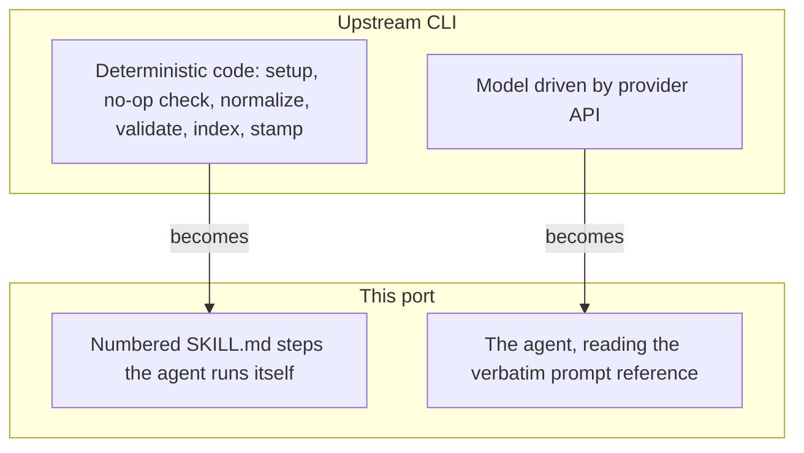

# The port contract

This repository contains no runtime. It is a **prompt port**: the upstream
[langchain-ai/openwiki](https://github.com/langchain-ai/openwiki) CLI drives a model
through provider APIs, and this repository re-expresses that same behavior as agent
skills a coding agent executes directly with its own filesystem and git tools. The
agent *is* the model, so the provider plumbing, credential onboarding, and connector
runtimes have no counterpart here — and no API key is needed.

Understanding this repository means understanding one thing: **which text is upstream's
and must not be touched, and which text is this port's own and may be rewritten.** That
distinction is the contract below, and every file in `skills/` is organized around it.

## The three fidelity layers

Every line in a skill belongs to exactly one layer.

| Layer | Marker | What it is | Rule when changing it |
|---|---|---|---|
| Verbatim upstream prompt | *(none)* | Text a model reads in upstream, reproduced byte-for-byte | Only ever changed by an upstream sync, as a near-direct diff |
| Adapted | `**[adapted]**` | Upstream behavior that exists here but differs because the harness differs | Free to reword, but the note must state what upstream does *and* what to do instead |
| Omitted | `**[omitted]**` | Upstream behavior with no counterpart here | Must state what upstream does and why it cannot be reproduced |

The unmarked-means-verbatim convention is what makes the port maintainable. Because
upstream's prompt strings are copied without paraphrase, an upstream release becomes a
readable diff against a known-identical base rather than a re-interpretation. The two
prompt reference files under `skills/openwiki/references/` exist precisely so those
strings live in one place per role, line-mapped to their upstream function.

An `[adapted]` note that only says *what to do here* is incomplete. It must also record
what upstream does, because the next sync compares against upstream's behavior, not
against this port's. The same applies to `[omitted]`: a bare omission is
indistinguishable from an oversight, so each one carries its reason.

## What upstream owns and what this port owns

Upstream splits work between a **model** (which reads prompts and writes pages) and
**deterministic code** (which prepares the wiki before the model runs and finalizes it
after). This port keeps that split, but the code half becomes numbered steps the agent
performs itself:

Upstream's two halves and their counterparts in this port.

The consequence worth internalizing: **a deterministic pass staying deterministic is a
correctness property, not a style preference.** Upstream's index generation, link
validation, provenance stamping, and front-matter normalization produce byte-identical
output for identical input, which is what lets a no-op run stay a no-op and lets the
upstream CLI and this port take turns maintaining the same wiki. When a skill step says
"write only when the content differs", that is preserving determinism, not saving I/O.

## Interoperability is the point

A wiki this port generates and a wiki the upstream CLI generates are the same artifact:
the same `openwiki/` layout, the same OKF front matter, the same
`openwiki/.last-update.json` run metadata. Either tool can continue a wiki the other
started. That is why the port reproduces upstream's exact file names, exact metadata
fields, and exact stamped-comment formats rather than equivalent-but-different ones —
see [the OKF output contract](../concepts/okf-output.md) for the artifact itself.

Two deliberate exceptions, both recorded where they occur:

- **Producer identity.** Upstream stamps its own version as the producing actor; this
  port stamps the host agent (`claude-code`, `codex`, `opencode`) instead, because
  claiming upstream's identity for output upstream did not generate would misattribute
  it.
- **Code-owned state with no reproducible format.** Where upstream persists state whose
  format only its own code can produce or interpret, the port omits it rather than
  inventing a look-alike. [Claims and grounding](../concepts/claims-and-grounding.md)
  covers the one significant case.

## Invariants for anyone changing this repository

- **Never paraphrase unmarked text.** If it is unmarked it is upstream's, and a
  paraphrase silently breaks the next sync's diff.
- **A behavior change needs a marker.** Introducing behavior upstream does not have, or
  dropping behavior it does, without an `[adapted]` or `[omitted]` note, leaves the port
  indistinguishable from drift.
- **Version stamps move together.** The pin in `UPSTREAM.md`, the skill intro lines, and
  the reference-file provenance headers all name the same upstream version. A sync that
  updates one and not the others leaves the port lying about its own base.
- **Deliberately duplicated files stay identical.** Skills install and load per
  directory, so a file two skills both need cannot be shared — it is copied, and the
  copies must not drift. [The upstream sync workflow](../workflows/upstream-sync.md)
  carries the guard for the one such file.
- **No positional parameters in shell snippets.** A dollar sign followed by a digit
  inside a `SKILL.md` is substituted with the skill's invocation arguments before the
  agent reads the file, which silently corrupts the command. Use a named variable.

## Scope boundaries

The port covers upstream's prompt-bearing and artifact-shaping behavior. It deliberately
does not cover provider plumbing, authentication, connector runtimes, schedulers,
telemetry, the interactive visualizer, or the CLI's own terminal UI — none of which a
skill can or should reproduce. `UPSTREAM.md` maintains the authoritative in-scope and
out-of-scope lists, path by path; [the upstream sync
workflow](../workflows/upstream-sync.md) explains how they are used.

Guidance this port originates itself — host-tool wiring for personal-wiki sources,
scheduling recipes, permission allowlists — is marked as port-original where it appears,
so it is never mistaken for upstream text on a later sync.
