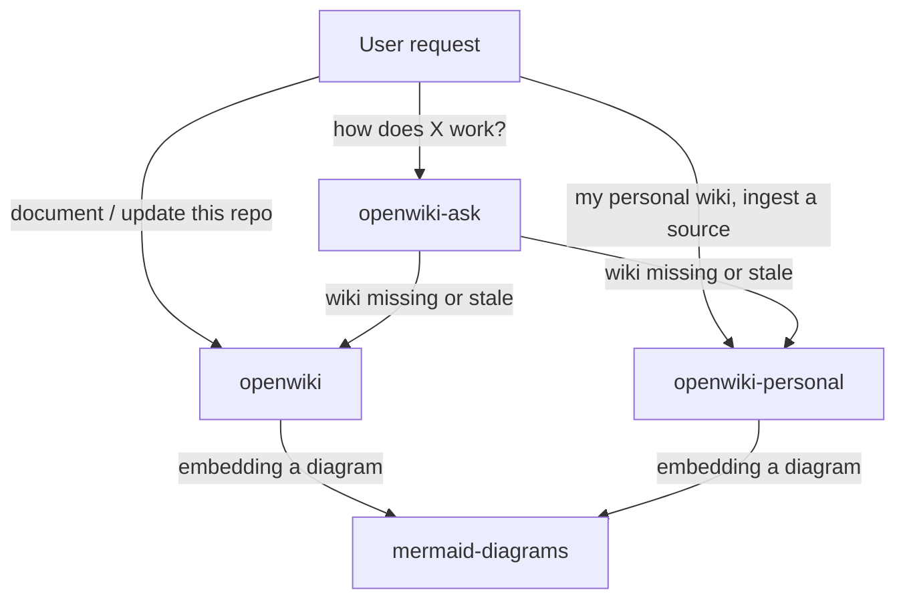

# Skill catalog and boundaries

Four skills ship from `skills/`. Upstream is one CLI with modes and a bundled companion
skill; this repository splits that surface along the lines a skill host can actually
route on — what the user is asking for — so each skill has one job and one entry
condition.

| Skill | Upstream counterpart | Job | Writes |
|---|---|---|---|
| `openwiki` | code mode (`--init` / `--update`) | Generate or refresh a repository's `openwiki/` wiki | `openwiki/**`, plus root `AGENTS.md` / `CLAUDE.md` marker blocks |
| `openwiki-personal` | personal mode (local-wiki) | Build or refresh the local knowledge wiki | `~/.openwiki/wiki/**`, plus the wiki brief on first init |
| `openwiki-ask` | chat mode | Answer questions from either wiki | Nothing |
| `mermaid-diagrams` | upstream's bundled skill | Diagram-type choice and Mermaid syntax safety | Nothing directly |

## Why the split is along modes, not along steps

Upstream selects behavior from flags and an output mode, then renders the matching prompt
template. A skill host selects behavior from what the user said. The two selection
mechanisms line up cleanly at mode boundaries and nowhere else, which is why the split is
`openwiki` / `openwiki-personal` / `openwiki-ask` rather than, say, one skill per
lifecycle step.

The practical consequence is that each skill owns a **write boundary** and none of them
overlaps:

- `openwiki` writes only under the target repository's `openwiki/` directory, and only
  its own Step 0 may touch root `AGENTS.md` / `CLAUDE.md`. The documentation work itself
  never touches them.
- `openwiki-personal` writes only under `~/.openwiki/wiki`, with the standing wiki brief
  at `~/.openwiki/INSTRUCTIONS.md` as its single exception, and only when the user
  supplies the goal.
- `openwiki-ask` writes nothing. A question that turns out to need a wiki change is
  routed back to whichever writing skill owns that wiki, rather than answered by editing.

`mermaid-diagrams` is the odd one out: it is consulted by the other two writing skills
rather than invoked on its own, which is exactly how upstream bundles it. It holds the
diagram-type decision table and the syntax-safety rules that keep a fence from failing
validation.

## How the skills route

Request routing between the four skills.

Routing is deliberately one-way for writes: `openwiki-ask` may *recommend* an update run
but never performs one, so a read-only question can never turn into an unrequested
mutation.

## Reference files and progressive disclosure

Long-form content lives behind `references/` files that a skill reads only when the run
actually needs it. The rule that decides placement is simple and worth stating because it
is easy to get backwards: **split content a run does not always read; keep content every
run executes inline.**

`skills/openwiki/references/`:

| File | Read when |
|---|---|
| `prompt-planner.md` | Every repository run, at the planning step |
| `prompt-page.md` | Every repository run, once per planned page |
| `index-labels.md` | Only when the wiki's language is not English |
| `automation.md` | Only when the user asks about scheduling or CI |
| `runtime-evidence.md` | Only when the user asks to fold in production traces |

`skills/openwiki-personal/references/`:

| File | Read when |
|---|---|
| `sources.md` | Every source-ingestion run, for the matching source |
| `connectors.md` | Only when wiring a new source to a host tool |
| `index-labels.md` | Only when the wiki's language is not English |

The two prompt files are the exception that proves the rule: they *are* read every run,
and they are split anyway — not for disclosure but because they are line-mapped copies of
two distinct upstream functions, and keeping them separate is what lets an upstream prompt
change apply as a direct diff.

The two `index-labels.md` files are byte-identical copies. Skills install and load per
directory, so a shared sibling would break a standalone install of either skill. They are
duplicated on purpose and guarded against drift by [the upstream sync
workflow](../workflows/upstream-sync.md).

## Repository layout beyond the skills

- `README.md` — the public surface: what the skills do, install, and the feature summary.
- `UPSTREAM.md` — the sync contract: pinned commit, path mapping, scope lists, procedure.
- `AGENTS.md` — this repository's own agent instructions, which are themselves the marker
  block the `openwiki` skill's Step 0 manages. `CLAUDE.md` is a one-line import of it, so
  Step 0's import exception applies to this repository too.
- `CHANGELOG.md` — one entry per release, house style being a small number of dense
  bullets that name the upstream PR numbers ported and the ones deliberately skipped.
- `docs/superpowers/` — the original design specs and implementation plans from the
  initial port. Historical: they describe how the repository came to exist, not how it
  behaves now.
- `static/` — the README lockup image.

There is no build, no dependency manifest, and no test suite: the deliverable is Markdown
that an agent reads. Verification is correspondingly manual — reading a skill against the
upstream source it maps to, and checking the structural invariants
[the port contract](port-contract.md) lists.
