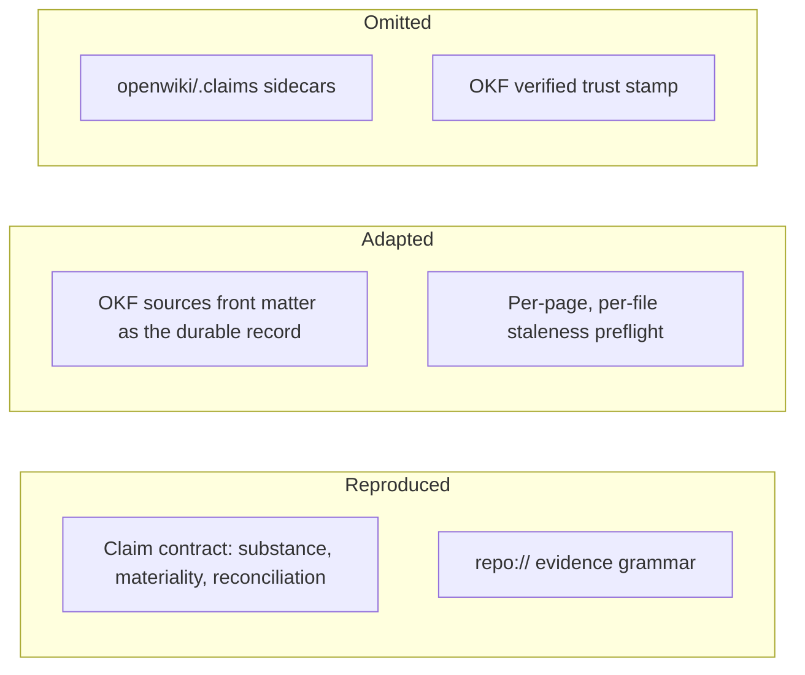

# Claims and grounding

Upstream 0.4.0 introduced **Claims** to make a code wiki self-correcting. A page does not
merely contain prose; it asserts a set of falsifiable propositions, each tied to the
source that supports it. When that source changes, the page is known to need attention —
so a wiki can detect its own staleness instead of waiting for a human to notice.

This is the one subsystem where the port makes a substantial, deliberate reduction. What
follows separates the contract (reproduced) from the persistence (partly adapted, partly
omitted), because conflating them is the easiest way to misread the skill.

## What a Claim is

A Claim is one independently verifiable, evidence-backed proposition about the system.
The substance standard is reproduced verbatim in
`skills/openwiki/references/prompt-page.md`; its load-bearing points:

- Claims capture **substantive system truths** — responsibilities and observable
  behavior, architectural roles and ownership boundaries, data and control flow,
  relationships, invariants, lifecycle and failure semantics, configuration, security,
  persistence, operations, extension boundaries.
- **Atomic means one falsifiable idea, not one file or symbol.** A single Claim may span
  several components and cite several resources when they jointly establish one
  end-to-end behavior.
- The **materiality test** is the filter: if the proposition were false, would it
  meaningfully change a reader's architectural model, implementation decision,
  operational expectation, or safe-change plan? If not, omit it.
- Existence is not materiality. A symbol existing, accepting a type, living at a path, or
  extending a base class is not a Claim unless that fact changes how the system is
  understood, used, operated, or safely changed.
- **Completeness outranks minimizing count.** Every material source-dependent
  proposition the page relies on should be represented; duplicates and trivia get removed
  afterward, not instead.

## The evidence grammar

Every Claim cites one or more repository resources in one canonical form:

```
repo://<repository-relative-path>
repo://<repository-relative-path>#L<start>-L<end>
```

A bare path is invalid. So is a resource pointing at `.git` metadata or at the generated
`openwiki/` tree — evidence is repository source, never the wiki's own output. A
single-line fragment such as `#L8` canonicalizes to `#L8-L8`, and an end line may not
precede its start.

Bounded spans are preferred where the span genuinely is the evidence; a whole-file
resource is correct when the whole file is. For a prose-and-Markdown repository like this
one, whole-file resources are usually the honest choice, since a rule's meaning does not
live in a line range that shifts on every edit.

## Reconciliation on update

A page worker submits the **complete intended Claim set** for its page — not a delta. The
reconciliation rules (also verbatim in `prompt-page.md`) turn that submission into
operations:

| Submission | Effect |
|---|---|
| Existing id, statement and evidence unchanged | Confirmed; evidence versions refresh |
| Existing id, statement or evidence changed | Updated in place, id retained |
| No id, no exact existing match | Added as a new Claim |
| Existing Claim absent from the submission | **Retracted** |

Two rules matter more than they look:

- A `stale` or `unresolved` marker is **an instruction to recheck current source**, not
  permission to retract. Retraction is for propositions that are no longer true, no longer
  material, or no longer asserted by the page.
- The final page body and the submitted Claim set **must agree**. A retracted Claim whose
  prose survives on the page is a contradiction; so is prose asserting something no Claim
  backs.

Because omission retracts, paraphrasing an unchanged statement or replacing a stable id is
destructive: it retracts the old Claim and adds a look-alike, losing the continuity that
staleness detection depends on.

## What this port reproduces, adapts, and omits

Upstream persists Claims as JSON sidecars under `openwiki/.claims/`, in which each piece
of evidence carries an **opaque resolver version** — a content hash for a whole file, and
for a line range a hash plus base64url-encoded relocation anchors that let the resolver
tell "this range moved" from "this range was rewritten". A separate pass then stamps an
OKF `verified` event once a page's whole Claim set reconciles durably.



Which parts of upstream's Claims subsystem survive the port.

The sidecars and the `verified` stamp are omitted, for stated reasons rather than
convenience:

- The **evidence versions are resolver-owned opaque tokens**. Only upstream's resolver can
  produce or interpret them, so a hand-written sidecar would either be wrong or be a
  different format wearing upstream's filename — which would break the interoperability
  the port exists to preserve.
- A **`verified` event with no durable Claim state behind it would assert a machine
  verification that never happened.** Writing it would make the wiki claim more than the
  port can support.

What survives is the durable record that *is* reproducible: each page's OKF `sources`
front matter. The finalize step projects every Claim's evidence, reduced to whole-file
form, into `sources` with deterministic OpenWiki-owned ids, retaining any entry another
producer authored. See [the OKF output contract](okf-output.md) for the field's shape.

## Staleness detection in this port

Upstream's preflight resolves every persisted Claim's evidence against current source and
classifies it `unresolved` (the resource is gone) or `stale` (its content version moved),
then feeds those issues to the planner *before* the no-op check — so a clean `git status`
can never hide stale grounding.

The port keeps that ordering and that consequence, reading `sources` front matter instead
of sidecars:

- A cited file that no longer exists, or is no longer a regular file → **unresolved**.
- A cited file that changed → **stale**, where "changed" is the union of the working-tree
  diff, untracked files, and the committed range since the last recorded head.
- A cited file that has become unreadable — newly excluded by `.openwikiignore`, or
  reached through a symlink — is a **hard failure upstream**. The port instead reports it
  as unresolved and names the page and resource, so the user can repair the rule or the
  page rather than have the run abort or the grounding vanish silently.

The fidelity gap is stated plainly in the skill and worth repeating: this is **per page
and per file**, where upstream is **per Claim and content-versioned**. It cannot
distinguish a line range that merely moved from one that was rewritten, it never surfaces
the "range can no longer be located" flavour of unresolved, and any page whose cited file
changed anywhere is flagged. It over-reports rather than under-reports, which is the safe
direction for a staleness check.

## Hard boundaries

- Claims are never hand-written into a wiki file. They are recorded through the
  submission gate, and only the finalize step turns them into front matter.
- `openwiki/.claims` and the `verified` field are never authored by this port — not even
  as placeholders.
- A page's submission gate **repairs before it judges** (upstream 0.4.1): recognized
  invalid OKF metadata is repaired or removed deterministically first, and the gate fails
  only on what no repair can fix — a missing or unreadable page, a shape that cannot be
  rebuilt, storage that cannot be written, or a submission with no material Claim.
  [The repository wiki run](../workflows/repository-wiki-run.md) covers the full gate list
  and where it sits in the lifecycle.
