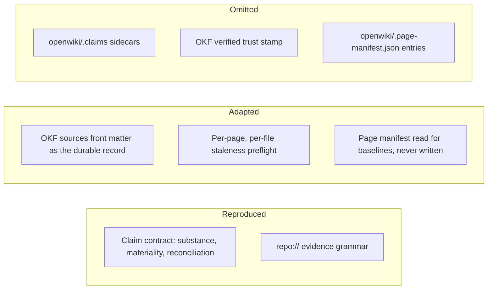

# Claims and grounding

Upstream 0.4.0 introduced **Claims** to make a code wiki self-correcting. A page does not
merely contain prose; it asserts a set of falsifiable propositions, each tied to the
source that supports it. When that source changes, the page is known to need attention —
so a wiki can detect its own staleness instead of waiting for a human to notice.

This is the one subsystem where the port makes a substantial, deliberate reduction. What
follows separates the contract (reproduced) from the persistence (partly adapted, partly
omitted), because conflating them is the easiest way to misread the skill.

## What a Claim is

A Claim is one independently verifiable, evidence-backed proposition about the system.
The substance standard is reproduced verbatim in
`skills/openwiki/references/prompt-page.md`; its load-bearing points:

- Claims capture **substantive system truths** — responsibilities and observable
  behavior, architectural roles and ownership boundaries, data and control flow,
  relationships, invariants, lifecycle and failure semantics, configuration, security,
  persistence, operations, extension boundaries.
- **Atomic means one falsifiable idea, not one file or symbol.** A single Claim may span
  several components and cite several resources when they jointly establish one
  end-to-end behavior.
- The **materiality test** is the filter: if the proposition were false, would it
  meaningfully change a reader's architectural model, implementation decision,
  operational expectation, or safe-change plan? If not, omit it.
- Existence is not materiality. A symbol existing, accepting a type, living at a path, or
  extending a base class is not a Claim unless that fact changes how the system is
  understood, used, operated, or safely changed.
- **Completeness outranks minimizing count.** Every material source-dependent
  proposition the page relies on should be represented; duplicates and trivia get removed
  afterward, not instead.

## The evidence grammar

Every Claim cites one or more repository resources in one canonical form:

```
repo://<repository-relative-path>
repo://<repository-relative-path>#L<start>-L<end>
```

A bare path is invalid. So is a resource pointing at `.git` metadata or at the generated
`openwiki/` tree — evidence is repository source, never the wiki's own output. A
single-line fragment such as `#L8` canonicalizes to `#L8-L8`, and an end line may not
precede its start.

Bounded spans are preferred where the span genuinely is the evidence; a whole-file
resource is correct when the whole file is. For a prose-and-Markdown repository like this
one, whole-file resources are usually the honest choice, since a rule's meaning does not
live in a line range that shifts on every edit.

## Reconciliation on update

Upstream 0.5.0 **inverted what silence means.** Until 0.4.3 a worker submitted the
complete intended Claim set and any omitted Claim was retracted; since 0.5.0 it submits
only the decisions its edits require, and an omitted Claim is *retained*. The payload is
three optional lists — `confirmedClaimIds`, `claims`, `retractedClaimIds` — and the
reconciliation rules (also verbatim in `prompt-page.md`) turn them into operations:

| Submission | Effect |
|---|---|
| Id in `confirmedClaimIds` | Confirmed after an explicit recheck; evidence versions refresh |
| Claim in `claims` with an existing id | Updated in place, id retained (a byte-identical restatement counts as a confirm) |
| Claim in `claims` with no id, no exact existing match | Added as a new Claim |
| Id in `retractedClaimIds` | **Retracted** |
| Existing Claim named nowhere, carrying **no** issue | **Retained automatically** |
| Existing Claim named nowhere, carrying a `stale`/`unresolved` issue | **Submission rejected** |

Three rules matter more than they look:

- A `stale` or `unresolved` marker is **an instruction to recheck current source**, not
  permission to retract. Retraction is for propositions that are no longer true, no longer
  material, or no longer asserted by the page.
- **Silence is retention, except where grounding work is owed.** Omitting an issue-free
  Claim is how a focused update leaves the rest of a page's grounding alone without
  round-tripping it through the model. Omitting a *flagged* Claim is the one thing the
  gate refuses, because that is the case where silence would skip required work.
- The final page body and the reconciled Claim set **must agree**. A retracted Claim whose
  prose survives on the page is a contradiction; so is prose asserting something no Claim
  backs.

The payload floor moved with the semantics. The old schema required at least one Claim in
every submission; the new one accepts an empty submission — every Claim retained by
omission — and instead checks the *net* result: `existing − retracted + added` must be at
least one, so a completed factual page can never end up with no Claim at all.

Two id disciplines round it out: each id may appear in exactly one of the three lists,
and an id the page does not own is invalid for a confirm or an update — but *tolerated*
for a retraction, deliberately, so that retrying after Claims persistence already
succeeded stays safe. Retraction is delete-like; confirm and update are not.

Never paraphrase or resubmit an unchanged Claim. Under the old rules that was destructive
because omission retracted; under the new ones it is destructive because it replaces a
stable id with a look-alike, losing the continuity staleness detection depends on. The
conclusion survived the inversion even though the reason changed.

Upstream also added an `inspect_claims` tool returning a page's complete current Claim
set on demand. The point is the discipline rather than the tool: the full set is a lookup
performed when a specific edit needs it, never a payload carried through the whole job.

## What this port reproduces, adapts, and omits

Upstream persists Claims as JSON sidecars under `openwiki/.claims/`, in which each piece
of evidence carries an **opaque resolver version** — a content hash for a whole file, and
for a line range a hash plus base64url-encoded relocation anchors that let the resolver
tell "this range moved" from "this range was rewritten". A separate pass then stamps an
OKF `verified` event once a page's whole Claim set reconciles durably.



Which parts of upstream's Claims subsystem survive the port.

The sidecars, the `verified` stamp, and the page-manifest entries are omitted, for stated
reasons rather than convenience:

- The **evidence versions are resolver-owned opaque tokens**. Only upstream's resolver can
  produce or interpret them, so a hand-written sidecar would either be wrong or be a
  different format wearing upstream's filename — which would break the interoperability
  the port exists to preserve.
- A **`verified` event with no durable Claim state behind it would assert a machine
  verification that never happened.** Writing it would make the wiki claim more than the
  port can support.
- A **page-manifest entry is only valid when a sidecar backs it.** Upstream builds each
  entry from a page whose `.claims` sidecar exists *and* carries a `verification` event
  matching the page's exact current bytes. With no sidecar there is nothing to build an
  entry from, so this third omission is not an independent decision — it falls directly
  out of the first.

That last dependency cuts both ways, and the direction it cuts is the safe one. Because a
port run leaves no sidecar, a later native run re-checking the ledger finds the coverage
**unverifiable** and re-reviews those pages rather than trusting a stale entry. Upstream's
rule that a no-op requires every page to have an entry is therefore deliberately *not*
ported either: that gate works only because upstream can both seed and record entries, and
a presence test here would wedge every future update into a full review.

The manifest's `gitHead` values are a different matter — they need no sidecar, so the port
reads them to plan each page against its own committed baseline. [The port
contract](../architecture/port-contract.md) states the general rule that follows from
this: omitting a state file does not mean ignoring it.

What survives is the durable record that *is* reproducible: each page's OKF `sources`
front matter. The finalize step projects every Claim's evidence, reduced to whole-file
form, into `sources` with deterministic OpenWiki-owned ids, retaining any entry another
producer authored. See [the OKF output contract](okf-output.md) for the field's shape.

**How much of sparse reconciliation is actually live here.** No sidecar means no persisted
Claim ids, so the id-keyed machinery has nothing to name: `confirmedClaimIds`,
`retractedClaimIds`, and `inspect_claims` have no targets, every submission is effectively
"all added", and the net floor reduces to the old rule that a completed page needs at least
one Claim. The upstream text is reproduced verbatim anyway, because that is what keeps the
next sync a readable diff.

One half does transfer, and it is the half with teeth — the rejection. At page granularity
it reads: for every resource the preflight flagged on this page, the finished page must
either **re-cite it**, having actually rechecked the file, or **stop citing it, with the
prose it supported corrected or removed**. Leaving a flagged resource cited without
rechecking it is precisely the omission upstream now refuses. The two disciplines behind
`inspect_claims` transfer as well: work from the flagged resources rather than re-deriving
a page's whole grounding, and read the page's full `sources` list only when about to revise
content whose grounding you were not shown.

## Staleness detection in this port

Upstream's preflight resolves every persisted Claim's evidence against current source and
classifies it `unresolved` (the resource is gone) or `stale` (its content version moved),
then feeds those issues to the planner *before* the no-op check — so a clean `git status`
can never hide stale grounding.

The port keeps that ordering and that consequence, reading `sources` front matter instead
of sidecars:

- A cited file that no longer exists, or is no longer a regular file → **unresolved**.
- A cited file that changed → **stale**, where "changed" is the union of the working-tree
  diff, untracked files, and the committed range since the last recorded head.
- A cited file reached **through a symlink** out of the repository → **unresolved**, and
  since upstream 0.5.2 that is upstream's classification too. Upstream used to abort the
  whole update on it and now reports it for reconciliation, on the reasoning that a
  containment refusal is *permanent* for the cited resource rather than an operational
  failure — a resource the resolver will always refuse is exactly a resource whose
  grounding needs a decision, not a resource whose run needs to die. This had been a
  port-original adaptation before upstream agreed; [the port
  contract](../architecture/port-contract.md) explains why that pattern matters.
- A cited file **newly excluded by `.openwikiignore`** is still a **hard failure
  upstream**, because 0.5.2 downgraded only the containment class and an excluded path
  raises a different error. The port still reports it as unresolved instead, names the
  page and resource, and lets the run finish, so the user can repair the rule or the page
  rather than have the run abort or the grounding vanish silently. That half remains an
  adaptation, and the boundary between the two halves is worth keeping straight: one is
  now shared with upstream, the other is still this port's own call.

The fidelity gap is stated plainly in the skill and worth repeating: this is **per page
and per file**, where upstream is **per Claim and content-versioned**. It cannot
distinguish a line range that merely moved from one that was rewritten, it never surfaces
the "range can no longer be located" flavour of unresolved, and any page whose cited file
changed anywhere is flagged. It over-reports rather than under-reports, which is the safe
direction for a staleness check.

## Hard boundaries

- Claims are never hand-written into a wiki file. They are recorded through the
  submission gate, and only the finalize step turns them into front matter.
- `openwiki/.claims`, the `verified` field, and `openwiki/.page-manifest.json` are never
  authored by this port — not even as placeholders. The manifest may be *read*; it may
  never be written, deleted, or repaired.
- A page's submission gate **repairs before it judges** (upstream 0.4.1): recognized
  invalid OKF metadata is repaired or removed deterministically first, and the gate fails
  only on what no repair can fix — a missing or unreadable page, a shape that cannot be
  rebuilt, storage that cannot be written, or a reconciliation leaving the page with no
  material Claim.
  [The repository wiki run](../workflows/repository-wiki-run.md) covers the full gate list
  and where it sits in the lifecycle.
