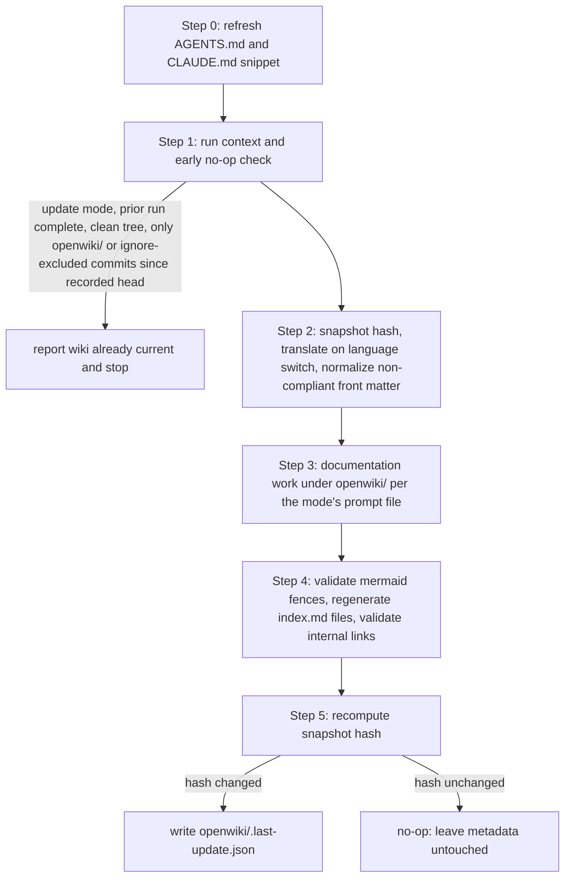

# openwiki-skill quickstart

## What this repository is

Agent skills that write, maintain, and answer from OpenWiki wikis — a port of [langchain-ai/openwiki](https://github.com/langchain-ai/openwiki) v0.3.2 for coding agents such as Claude Code and Codex. Upstream 0.1.0 split into two modes, and the port mirrors that: **code mode** documents a repository in `openwiki/`; **personal mode** maintains a local knowledge wiki at `~/.openwiki/wiki` fed by the user's own sources. The generated wikis are OKF-compliant (Google Knowledge Catalog OKF v0.1): every concept page opens with YAML front matter (only `type` required; producer extension fields preserved), pages cross-link as an evidence-backed concept graph, each wiki directory gets a deterministically regenerated `index.md`, and non-compliant pages are normalized automatically at the start of every run. Since 0.2.3 pages that document runtime flows, lifecycles, or data models also embed source-grounded Mermaid diagrams, validated after every run (broken fences degrade to text fences instead of breaking rendering). Since 0.2.4 a wiki can be kept in any language: the output language is persisted run state (BCP-47 in `.last-update.json`), index headings localize from a curated table, and an update that switches the language retranslates every page before the documentation work. Since 0.2.5 a repo-root `.openwikiignore` (gitignore-style, code mode only) is a read boundary: matching paths are never read, scanned, or documented (since 0.3.0 active rules make git history unavailable to the run entirely). Since 0.3.0 each command has its own prompt (upstream #528): code-mode init builds a complete wiki — skeleton-first mapping, an independent critic subagent, evidence gates, and a question-finder/answer-verifier QA loop, with no page budget — update makes impact-plan-driven edits with no preset page limit, and internal links and heading anchors are validated after every run, broken ones stamped in place for the next update to repair (since 0.3.1 link targets resolve repo-wide, so a wiki page may link out to any repository file).

The upstream project is a CLI that drives an LLM through provider APIs (API keys, OAuth connectors, an agent runtime, a scheduler). This repo exists because a coding agent already *is* that LLM, with filesystem, git, MCP, and web-search tools attached — so the port keeps upstream's product value (its agent prompts and runtime bookkeeping) and deletes the plumbing. Result: no API key, no OAuth, no runtime, no configuration. Install and usage live in [`README.md`](../README.md); this wiki is the map of how the repo itself is built.

## Layout

| Path | Role |
|---|---|
| [`skills/openwiki/SKILL.md`](../skills/openwiki/SKILL.md) | Code mode: generate (init) or surgically refresh (update) a repo's `openwiki/` wiki. Mode auto-detection, then a 6-step runtime (below) — Step 0 manages the `<!-- OPENWIKI:START/END -->` snippet in `/AGENTS.md` and `/CLAUDE.md`; Step 3 routes to the per-command prompt file. |
| [`skills/openwiki/references/prompt-init.md`](../skills/openwiki/references/prompt-init.md) | The init run's system prompt (since 0.3.0, upstream `src/agent/prompts/code.ts`): skeleton-first workflow with evidence gates and a QA verification loop, plus the three init-only read-only subagents reproduced verbatim (`skeleton_critic`, `wiki_question_finder`, `wiki_answer_verifier`) and the init user prompt. |
| [`skills/openwiki/references/prompt-update.md`](../skills/openwiki/references/prompt-update.md) | The update run's system prompt (since 0.3.0): impact-plan-driven surgical edits with no preset page limit, "Coding-agent utility requirements" (task-routing table, symbol-level mappings, change recipes), the OKF `openwiki` producer extension, and the update user prompt. |
| [`skills/openwiki/references/automation.md`](../skills/openwiki/references/automation.md) | Scheduled updates: keyless options (subscription `claude -p` via cron, cloud routine), a scoped permission allowlist, GitHub Actions / GitLab CI / Bitbucket Pipelines templates (full-history clones since 0.3.0), a Codex headless note, and personal-wiki schedules (§5). |
| `references/index-labels.md` (in both wiki skills) | The localized `Files`/`Directories`/derived-`type` label table (upstream `index-labels.ts`), read by Step 4 only when the wiki language is not English — the `en` labels stay inline in each SKILL.md. |
| [`skills/openwiki/references/runtime-evidence.md`](../skills/openwiki/references/runtime-evidence.md) | Runtime evidence runs (added 0.2.4): upstream's LangSmith code-mode connector as an on-request repo update — the `langsmith` synthesis-guidance block verbatim (anomaly-weighted error/outlier/baseline trace sample synthesized into a consolidated `runtime-behavior.md` plus the code pages it concerns), with `[adapted]` evidence gathering via host LangSmith MCP/API tools instead of the connector runtime. |
| [`skills/openwiki-personal/SKILL.md`](../skills/openwiki-personal/SKILL.md) | Personal mode: build or maintain `~/.openwiki/wiki` from upstream's personal templates (canonical pages, confidence labels, email taxonomy; since 0.3.0 the init/update templates differ only in their mode block, so the skill inlines the shared text once); evidence comes from the host's MCP servers, web search, and local repos instead of upstream's OAuth connectors. |
| [`skills/openwiki-personal/references/sources.md`](../skills/openwiki-personal/references/sources.md) | Source update runs: the per-source prompt (24h window) plus upstream's synthesis policy and per-source guidance (gmail/notion/x/hackernews/web-search/slack/git-repo), verbatim. |
| [`skills/openwiki-personal/references/connectors.md`](../skills/openwiki-personal/references/connectors.md) | Guidance-only (port-original, no upstream counterpart): per upstream connector, its actual upstream mechanism (direct OAuth APIs for Slack/Gmail/X, Tavily, public HN APIs, Notion MCP, local git-repo reads) and the suggested host-tool stand-in, plus port-only sources (e.g. GeekNews via its Atom feed), a researched Slack route (custom app + xoxp user token), and the `~/.openwiki/.env` credential convention shared with upstream `src/config/env.ts`. |
| [`skills/openwiki-ask/SKILL.md`](../skills/openwiki-ask/SKILL.md) | Q&A over both wikis, wiki-first (upstream's "Wiki-first question answering" rules, which are mode-parameterized since 0.2.1), citing pages and their inline source references. |
| [`skills/mermaid-diagrams/SKILL.md`](../skills/mermaid-diagrams/SKILL.md) | Upstream's bundled diagram-authoring skill (added 0.2.3), near-verbatim: diagram-type choices and Mermaid syntax-safety rules that the wiki skills' "Diagram discipline" consults; only the validation-ownership line is `[adapted]` (validation happens in the wiki skills' Step 4 here). |
| [`UPSTREAM.md`](../UPSTREAM.md) | Canonical for upstream tracking: pinned upstream commit, the prompt-branch → skill mapping, and the sync procedure (including the index-labels copy-drift guard). |
| [`docs/superpowers/`](../docs/superpowers/) | Design specs (Korean) and implementation plans. The plans embed the skill contents or deterministic extraction commands, plus the verification scripts that check them. |
| `static/` | README assets (the generated lockup banner). |
| [`CHANGELOG.md`](../CHANGELOG.md), [`LICENSE`](../LICENSE) | Release log (one bullet per change); MIT. |

## How the wiki skills work

Upstream's CLI wraps one LLM agent in runtime bookkeeping (`src/agent/utils.ts`), parameterized by output mode. Each skill reproduces its mode's wrapper as explicit steps the host agent performs directly.

`openwiki` (code mode), 6 steps:

0. **Code setup** — idempotently maintain the `<!-- OPENWIKI:START/END -->` snippet in `/AGENTS.md` and `/CLAUDE.md` (ported from `src/ingestion/code-mode.ts`; the snippet body says "optional just-in-time context" since 0.3.0, and a file with malformed or duplicated markers fails the setup before either file is written, #547; legacy marker-less sections are migrated, an `@AGENTS.md`-importing CLAUDE.md counts as covered, upstream's GH Actions workflow generation is deliberately omitted).
1. **Run context + early no-op check** — reads the optional user-authored `openwiki/INSTRUCTIONS.md` brief (injected into the user prompt as "Wiki brief"; control metadata the run never rewrites), resolves the wiki's effective output language (requested → persisted in metadata → explicit `en`; ported from `resolveLanguage` + `createRunContext`, since 0.2.4), and loads repo-root `.openwikiignore` rules (gitignore-compatible matching, ported from `src/agent/openwiki-ignore.ts`, since 0.2.5), then runs the *early no-op check* (ported from `getUpdateNoopStatus`): clean worktree (`status --short --untracked-files=all`, ignoring metadata and ignore-excluded lines) + only `openwiki/` or ignore-excluded paths in `diff --name-only <recorded head>..HEAD` → report "already current" and stop — unless the previous run's metadata says `status: "interrupted"`, which forces a retry (since 0.2.4). Since 0.3.0 this check is the only git the runtime runs: the injected git summary was deleted (`createGitSummary`), and the update prompt has the agent inspect the history range itself during Step 3.
2. **Content snapshot + translation + normalization** — hash the `openwiki/` tree (excluding metadata and the plan file); on update runs bring existing pages into the effective language (ported from `translation-middleware.ts`, since 0.2.4: retranslate everything only on a real language switch, otherwise just retry pages marked `openwiki_translation_pending`); then normalize any non-compliant page to a minimal derived front matter block flagged `openwiki_generated: true` (ported from `createOpenWikiContentSnapshot` + `migrateWikiToOkf`; since 0.2.1 this code pass replaces the former migrate-wiki-to-okf skill; since 0.2.4 the derived `type` localizes and a pending-translation marker survives the rebuild).
3. **The system prompt** — since 0.3.0 (upstream #528) each command has its own template (`src/agent/prompts/code.ts`, rendered by `src/agent/prompt.ts`), reproduced *verbatim* in `references/prompt-init.md` and `references/prompt-update.md`; harness differences marked `**[adapted]**`, content owned by the other skills marked `**[omitted]**`. Init is a skeleton-first workflow (temporary `openwiki/_skeleton.md`, agent-deleted at the end) with an evidence gate before prose, no page budget, a critic review, and a question/answer verification loop through three read-only subagents. Update is impact-plan-driven with no preset page limit and carries the "Coding-agent utility requirements" (task-routing quickstart table, symbol-level mappings, change recipes, quiet narrow validation). Both prompts carry the OKF sections (front matter now including the optional namespaced `openwiki` producer extension), the "Diagram discipline", the "Output language" section, the `.openwikiignore`-conditional passages (active rules make git history unavailable and restrict discovery to file tools), and the appended "Link integrity" section.
4. **Diagram validation + index sync + link validation** — validate every ```mermaid fence and degrade unparseable ones to ```text fences behind an `openwiki: mermaid parse failed` HTML comment (ported from `src/mermaid/wiki.ts`; the parser is replaced by upstream's own no-parser heuristic plus the `mermaid-diagrams` syntax rules), then regenerate every wiki directory's `index.md` deterministically (ported from `src/okf/index-sync.ts`: front-matter-free `# Files`/`# Directories` listings — headings localized to the wiki language from the `index-labels.ts` table since 0.2.4, shipped as each wiki skill's `references/index-labels.md` and read only for non-English wikis — `okf_version: "0.1"` only on the root index, write-only-on-diff), after a repair backstop for any page still lacking a usable `type`; finally validate internal links and heading anchors (ported from `src/agent/wiki-link-validator.ts`, since 0.3.0: GitHub-style anchor slugs, previous stamps cleared, broken links stamped in place with an `openwiki: broken internal link` comment — the run never fails on them; since 0.3.1 targets resolve repo-wide rather than wiki-confined, anchors are checked only on `.md` targets, and slugs match `github-slugger` exactly).
5. **Metadata** — recompute the hash; only if content changed, write `openwiki/.last-update.json` (`updatedAt`, `command`, `gitHead`, `model`, and since 0.2.4 `status` and `language`) — even when the run failed after generating content, then with `status: "interrupted"` so the next update retries instead of no-op-skipping (ported from `persistRunMetadataIfChanged`; a completed retry that changes nothing still rewrites metadata once to clear a leftover interrupted status).



Code-mode run lifecycle: the bookkeeping steps around the Step 3 documentation work, including the two no-op exits ([`skills/openwiki/SKILL.md`](../skills/openwiki/SKILL.md) Steps 0–5).

`openwiki-personal` (personal mode) runs the same shape without git: no evidence step or early no-op (upstream's is repository-only), the snapshot/index-sync/metadata root is `~/.openwiki/wiki`, and metadata omits `gitHead` — all matching upstream's local-wiki branches of `utils.ts`. Its wiki goal lives in `~/.openwiki/INSTRUCTIONS.md` (asked once at init), and source-scoped requests follow `references/sources.md`.

The verbatim strategy is deliberate (chosen in the v2 design pivot, see `docs/superpowers/specs/`): it keeps generated wikis byte-compatible and interoperable with the upstream CLI — either tool can continue a wiki the other started — and it makes upstream syncs near-direct line diffs instead of re-interpretation.

## Changing this repo

- **The prompt files are line-mapped to upstream's per-command templates** (since 0.3.0): [`skills/openwiki/references/prompt-init.md`](../skills/openwiki/references/prompt-init.md) / `prompt-update.md` ↔ `src/agent/prompts/code.ts` (plus the subagent files), and the personal skill's Step 3 ↔ `src/agent/prompts/personal.ts`. Keep upstream sentences verbatim; mark every deviation `**[adapted]**` and every omission `**[omitted]**`. Two spans must stay byte-identical to upstream: the AGENTS.md snippet in [`skills/openwiki/SKILL.md`](../skills/openwiki/SKILL.md) Step 0 (vs `src/ingestion/code-mode.ts`) and the synthesis/policy blocks in the personal skill and `sources.md` (vs `prompts/personal.ts`/`ingestion.ts`) — silent unmarked edits break future syncs.
- **After editing any skill file, re-run the verification scripts** embedded in `docs/superpowers/plans/2026-07-10-openwiki-0.1.0-port.md`: frontmatter YAML parse per skill, snippet/synthesis byte-diffs against the upstream clone, section survival checks, README relative-link check.
- **When upstream moves:** follow the sync procedure in [`UPSTREAM.md`](../UPSTREAM.md) (diff the mapped paths since the pin, port per the mapping table, bump the pin, add a CHANGELOG entry).
- **Testing:** there is no automated suite; the 0.1.0 plan's Task 7 documents the manual E2E scenarios (code init → legacy-AGENTS.md migration → two-phase no-op; personal init/source-update/no-op under an isolated `HOME`; ask routing over both wikis).
- Skill frontmatter descriptions stay double-quoted single-line strings, and all skill-facing text is English.
- Repo-internal research notes (e.g. connector feasibility studies) live in `.internal/` — gitignored, local-only, never committed; keep publishable guidance in the skills' `references/` instead.
