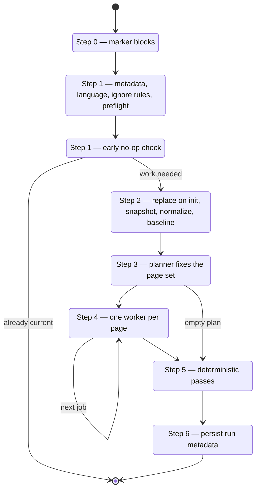

# Repository wiki run

Upstream 0.4.0 replaced one long authoring turn with a **resumable page-job lifecycle**: a
bounded planner fixes the complete page set, one fresh worker writes each page and records
its Claims, and deterministic code finalizes the result. `skills/openwiki/SKILL.md`
reproduces that as steps 0 through 6, routing the two model-facing roles to
`references/prompt-planner.md` and `references/prompt-page.md`.

The restructuring is not cosmetic. Splitting planning from authoring means page paths are
**decided once and final**, and confining each worker to a single page means a run cannot
quietly rewrite pages nobody asked it to touch.

## Mode resolution, and why init is destructive now

Explicit init or update wins; otherwise `openwiki/quickstart.md` existing means update.

**Since upstream 0.4.0 an init regenerates the wiki from scratch**, preserving only a
user-authored `openwiki/INSTRUCTIONS.md`. That makes mode resolution a safety question, not
a convenience one — so when auto-detection lands on init because `openwiki/` exists without
a `quickstart.md`, the skill says so and asks before wiping. The user may have meant update.

Three inputs force a run past the no-op check: an additional user instruction, a changed
output language, and any staleness the preflight finds.

## The seven steps

The repository lifecycle, including both early exits.

### Step 0 — marker blocks

Root `AGENTS.md` and `CLAUDE.md` each carry a managed block between
`<!-- OPENWIKI:START -->` and `<!-- OPENWIKI:END -->`. Since upstream 0.3.3 they get
**different** snippets: AGENTS.md the full block, CLAUDE.md a one-line pointer to it, so a
single file stays the canonical source of agent instructions while Claude Code still has a
file it reads at startup.

Marker validation is strict and **all-or-nothing across both files**: a file with markers
must have exactly one `START` followed by exactly one `END`, and malformed or duplicated
markers fail the setup with neither file written. A malformed sibling therefore leaves both
untouched — the property that keeps a half-applied setup from happening.

Two port-specific behaviors: a legacy unmarked `## OpenWiki` section is replaced rather
than duplicated, and a `CLAUDE.md` that imports AGENTS.md counts as covered, since the
import already does the pointer's job.

Only Step 0 may touch these files. The documentation work never does.

### Step 1 — context, preflight, no-op

Reads run metadata and the wiki brief, resolves the effective language, and loads
`.openwikiignore`. Since 0.5.0 an **unrecognizable language request stops the run here**,
before any write, rather than warning and generating in English — the old fallback
persisted the wrong language and the next run inherited it, so the mistake could not be
undone without deleting OpenWiki's own state.

Then the two native-CLI lifecycle files, both of which the port refuses to write:

| File | What it is | What the port does |
|---|---|---|
| `openwiki/.run.json` | Transient checkpoint from an interrupted native run | Reports it; never reads it as instructions, never deletes or writes one |
| `openwiki/.page-manifest.json` | **Committed** per-page coverage ledger, new in 0.5.0 | Reads each entry's `gitHead`; never writes, deletes, or repairs it |

The manifest read is what upgrades update planning. Each entry records the commit its page
was last verified against, so pages are grouped into **per-page update windows** — cohorts
sharing a baseline, each with its own changed-path set — and a page whose baseline already
covers a change is not regenerated for it. A page with no entry falls into a full-review
cohort. With no manifest present the port has exactly one provable baseline, the recorded
`gitHead`, so the whole wiki forms a single window; that is what this port did before
0.5.0. A cohort whose changed-path set is empty needs no source-driven work, which is how
upstream's separate baseline fast-forward falls out of the window itself here.

Why the write is withheld, and why that is safe, is [Claims and
grounding](../concepts/claims-and-grounding.md)'s subject: an entry is only valid when a
`.claims` sidecar backs it, so the port cannot build one, and a later native run correctly
treats port-authored coverage as unverifiable and re-reviews it.

Then the **evidence preflight** — and its position matters. Upstream deliberately runs
Claims validation *before* no-op detection, so **a clean `git status` cannot hide stale
grounding**. A repository whose source moved in ways git has already recorded as committed
and clean would otherwise look current while its pages cite code that changed.
[Claims and grounding](../concepts/claims-and-grounding.md) covers the classification.

The no-op check then requires a clean worktree and an unmoved head, ignoring the status
lines for the two files the lifecycle itself rewrites — `.last-update.json` and, since
0.5.0, `.page-manifest.json` — plus any `.openwikiignore`-excluded paths. Since 0.4.0 a
no-op still **refreshes `.last-update.json`** — carrying the previous run's model and
language forward with a fresh timestamp — because a no-op run still means the wiki was
checked. It is the run's only write; nothing else executes.

One asymmetry there is deliberate and easy to get backwards: the manifest's git-status line
is ignored by the no-op check, but the manifest is **not** excluded from the content
snapshot, because it is committed wiki output and a change to it is a real content change.
Upstream's one gate the port does *not* reproduce is its requirement that every page have a
manifest entry before a no-op is allowed — that test only works for a producer that records
entries, and applying it here would turn every future update into a full review.

### Step 2 — prepare

On **init**, replace the wiki: back it up to a private temp directory, wipe it, recreate it
empty, restore only `INSTRUCTIONS.md`. The skill refuses outright if `openwiki` is not a
real directory or is a symlink, or if `INSTRUCTIONS.md` is not a regular file. Because this
port has no resumable checkpoint, it **holds the backup for the whole run** — where
upstream drops it once its checkpoint is durable and treats partial pages as the recovery
path.

Then, for both modes: snapshot the content hash, normalize front matter, and capture the
provenance baseline (each page's body hash plus its existing `generated` event).

Upstream additionally fingerprints every source file here and re-checks it later. Until
0.4.2 a mid-run change **invalidated the plan** and forced a full replan; upstream 0.4.3
deleted that loop on the same reasoning as a skipped page — a partially refreshed wiki plus
a forced follow-up beats discarding the work. Drift is now merely *detected*, twice: before
the finalize passes and again after Claims finalization, so a change that starts mid-finalize
still counts.

The port does the cheap equivalent — record the head and worktree state, re-check at both
points — and Step 6 turns a positive result into metadata rather than only a sentence in the
report.

### Step 3 — plan

The planner is **read-only**: filesystem discovery tools, no shell, no write access to any
wiki page, no delegation. It explores manifests, directories, entrypoints and public
surfaces, traces end-to-end flows, checks focused tests — then fixes the page set.

Its design instruction is worth quoting for what it rules out: organize around **owned
systems, runtime domains, and cross-system workflows rather than mirroring the source
tree**, and do not emit a flat dump of unrelated top-level pages. Hierarchical groups are
expected where the repository warrants them.

The plan is then hard-validated. Init must include quickstart and may delete nothing;
quickstart is never deletable; no duplicates; no page both generated and deleted; reserved
and underscore-prefixed paths rejected. Update runs get required jobs **injected** for work
the planner omitted — one per page named by a preflight issue, and one per existing concept
page when the language changed. The queue is then ordered deterministically with
**quickstart last**, because it is the synthesis and navigation page and needs the domain
pages to exist first.

An update whose plan has no pages and no deletions is legitimate and skips straight to
finalize.

### Step 4 — the page queue

One worker per page, in queue order, each owning **exactly one page**. Upstream gives a
worker read access to the repository and write access to its own page only, with no shell
and no delegation tool.

Two boundaries replace behavior earlier versions of this skill had:

- **No subagents.** Upstream 0.4.0 deleted its critic and QA subagents and strips the
  delegation tool from every worker. The queue is worked sequentially, and the same page's
  research is never delegated twice.
- **No working files.** The plan lives in working notes. `_plan.md` and `_skeleton.md` no
  longer exist and any underscore-prefixed page path is rejected.

A page is not done until it passes its gates: the file exists and is readable, its OKF
front matter validates **after a deterministic repair attempt** (upstream 0.4.1 repairs
recognized invalid metadata first and fails only on what repair cannot fix), every Claim
carries at least one canonical `repo://` resource, no duplicate Claim is submitted and no
id receives more than one decision, and the reconciliation leaves the page with at least
one material Claim.

Since 0.5.0 that reconciliation is **sparse**: a worker submits only the decisions its
edits require, and an omitted issue-free Claim is retained rather than retracted. The one
omission the gate refuses is a Claim carrying a `stale` or `unresolved` issue — that is
exactly the case where silence would skip required grounding work. In this port, which has
no Claim ids to name, the rule applies per page: every resource the preflight flagged must
end up either re-cited after an actual recheck, or no longer cited with the prose it
supported corrected. [Claims and grounding](../concepts/claims-and-grounding.md) has the
full table and how much of the sparse machinery is live here.

Restating an already-fixed plan is not an error, but replacing it is. Upstream 0.5.0
dropped its "already submitted" guard and instead compares a second submission against the
persisted plan, accepting an identical one and rejecting a different one. The rule that
survives for a port with no tool: **the page set is fixed once the queue starts** — pages
already written were planned against it.

#### A page you cannot finish is skipped, not fatal

Before upstream 0.4.1 a worker that could not complete aborted the whole update, discarding
every page already written. The failure is now contained to its own page:

1. **Snapshot** the page's exact current Markdown — or that it does not exist — before
   working it. An absent page is a *valid* snapshot, never a failure: it is the normal case
   on init and for every newly planned page. Upstream had to fix precisely this in 0.4.2,
   where a missing page could throw and abort the run.
2. **If it cannot be completed**, restore the snapshot exactly (or delete the page if it
   was not there), mark the job **skipped**, say which page and why, and move on. Never
   leave a half-written page behind. A delete reporting the file was already absent is
   *success*: upstream had to widen that check in 0.5.0 because its backends spell the
   outcome two different ways, and a rollback treating "already gone" as an error aborts a
   run for no reason.
3. **Keep going.** Skipped jobs block neither the queue nor finalization.

One failure stays fatal: a page that cannot be *persisted at all*. A page that merely fails
validation is correctable; storage that cannot be written is not.

The point of the design is that a wiki is worth more partially refreshed than not refreshed
at all — provided the next run knows to come back, which is Step 6's job.

### Step 5 — finalize

In exactly this order: restore skipped pages, apply deletions, validate Mermaid,
synchronize directory indexes, validate internal links, project Claim evidence into
`sources`, reconcile `generated` provenance. Deletions come early so the index and link
passes see the final page set; provenance comes last so the front-matter edits the other
passes make do not register as body changes.

Skipped pages are restored once more here — a later pass may have touched them — and are
then **excluded** from the `sources` projection and from Claims reconciliation. Projecting
an empty Claim set onto a skipped page would strip the grounding the previous run recorded,
which is the opposite of leaving it alone.

Deletions themselves are two-part: pages this run created that a superseded plan abandoned,
then the plan's explicit deletion set. Neither ever touches a page that existed before the
run and was not planned for deletion. Since 0.4.3 removed in-run replanning, the first part
has nothing left to find in practice — it remains as the guard for a plan that was replaced.

### Step 6 — metadata

Writes `openwiki/.last-update.json` — timestamp, command, head, model, status, language —
on every completed run, so the content hash no longer gates the write, only the report.

**If any page was skipped, or the source changed mid-run**, the metadata is written
differently: `status: "interrupted"`, and `gitHead` rewound to the **previous** run's head
rather than the current one — or omitted entirely when there is no previous head, which
upstream 0.4.3 made explicit after the old fallback silently recorded the current head. Both
serve one purpose: the next update must not treat this wiki as complete and current. The
`interrupted` status defeats the early no-op exit, and the rewound head keeps the changed
paths and staleness evidence in view. Recording the current head would make the skipped page,
or the source change, invisible to every future update.

On drift the run also says so plainly — the wiki was finalized without advancing its source
checkpoint, so a follow-up update is needed. The metadata forces that run; the message
explains it.

This metadata is also **this port's answer to upstream's page manifest.** Upstream 0.5.0
made partial progress a publishable result: it commits the pages a run finished even when
the run failed, and its CI opens the pull request anyway so that progress can be merged as
the next run's baseline. Upstream's baseline is the per-page manifest entry each completed
page earned; the port's is exactly what this step writes — the finished pages, plus
`status: "interrupted"` and a rewound head, which together say "this much is done, the rest
is still owed." The practical consequence for a run that ends partway: report which pages
landed and which were skipped, and treat the result as committable rather than something to
tidy away. [Keeping wikis fresh automatically](../operations/automation.md) carries the
matching CI shape.

The failure path has two more exceptions. A failed init **that had a backup** restores it
and writes **no** metadata, because the restored wiki's own metadata came back with it and
an `interrupted` record on top would describe a wiki that no longer exists. A failed
**first** init, with no prior wiki and so no backup, keeps its partial content and records
`interrupted`.

## Runtime evidence variant

A repository update can fold production traces into the wiki. Every step still applies; the
guidance block becomes the planner's context, letting the planner scope a runtime-behavior
page plus the code pages the findings concern. See
[automation](../operations/automation.md) for the operational constraints.
