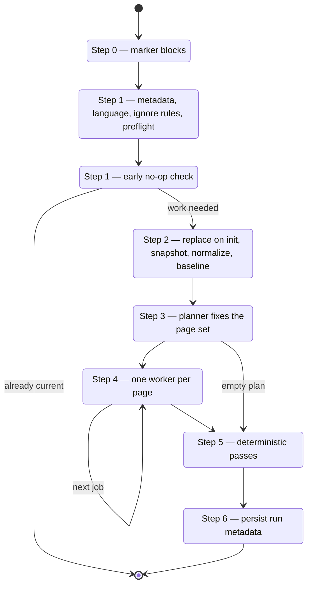

# Repository wiki run

Upstream 0.4.0 replaced one long authoring turn with a **resumable page-job lifecycle**: a
bounded planner fixes the complete page set, one fresh worker writes each page and records
its Claims, and deterministic code finalizes the result. `skills/openwiki/SKILL.md`
reproduces that as steps 0 through 6, routing the two model-facing roles to
`references/prompt-planner.md` and `references/prompt-page.md`.

The restructuring is not cosmetic. Splitting planning from authoring means page paths are
**decided once and final**, and confining each worker to a single page means a run cannot
quietly rewrite pages nobody asked it to touch.

## Mode resolution, and why init is destructive now

Explicit init or update wins; otherwise `openwiki/quickstart.md` existing means update.

**Since upstream 0.4.0 an init regenerates the wiki from scratch**, preserving only a
user-authored `openwiki/INSTRUCTIONS.md`. That makes mode resolution a safety question, not
a convenience one — so when auto-detection lands on init because `openwiki/` exists without
a `quickstart.md`, the skill says so and asks before wiping. The user may have meant update.

Three inputs force a run past the no-op check: an additional user instruction, a changed
output language, and any staleness the preflight finds.

## The seven steps

The repository lifecycle, including both early exits.

### Step 0 — marker blocks

Root `AGENTS.md` and `CLAUDE.md` each carry a managed block between
`<!-- OPENWIKI:START -->` and `<!-- OPENWIKI:END -->`. Since upstream 0.3.3 they get
**different** snippets: AGENTS.md the full block, CLAUDE.md a one-line pointer to it, so a
single file stays the canonical source of agent instructions while Claude Code still has a
file it reads at startup.

Marker validation is strict and **all-or-nothing across both files**: a file with markers
must have exactly one `START` followed by exactly one `END`, and malformed or duplicated
markers fail the setup with neither file written. A malformed sibling therefore leaves both
untouched — the property that keeps a half-applied setup from happening.

Two port-specific behaviors: a legacy unmarked `## OpenWiki` section is replaced rather
than duplicated, and a `CLAUDE.md` that imports AGENTS.md counts as covered, since the
import already does the pointer's job.

Only Step 0 may touch these files. The documentation work never does.

### Step 1 — context, preflight, no-op

Reads run metadata and the wiki brief, resolves the effective language, loads
`.openwikiignore`, and reports any `openwiki/.run.json` left by an interrupted upstream CLI
run without reading, deleting, or writing one.

Then the **evidence preflight** — and its position matters. Upstream deliberately runs
Claims validation *before* no-op detection, so **a clean `git status` cannot hide stale
grounding**. A repository whose source moved in ways git has already recorded as committed
and clean would otherwise look current while its pages cite code that changed.
[Claims and grounding](../concepts/claims-and-grounding.md) covers the classification.

The no-op check then requires a clean worktree and an unmoved head, ignoring the metadata
file itself and any `.openwikiignore`-excluded paths. Since 0.4.0 a no-op still **refreshes
`.last-update.json`** — carrying the previous run's model and language forward with a fresh
timestamp — because a no-op run still means the wiki was checked. It is the run's only
write; nothing else executes.

### Step 2 — prepare

On **init**, replace the wiki: back it up to a private temp directory, wipe it, recreate it
empty, restore only `INSTRUCTIONS.md`. The skill refuses outright if `openwiki` is not a
real directory or is a symlink, or if `INSTRUCTIONS.md` is not a regular file. Because this
port has no resumable checkpoint, it **holds the backup for the whole run** — where
upstream drops it once its checkpoint is durable and treats partial pages as the recovery
path.

Then, for both modes: snapshot the content hash, normalize front matter, and capture the
provenance baseline (each page's body hash plus its existing `generated` event).

Upstream additionally fingerprints every source file here and re-checks it at finalize,
invalidating the plan on drift — a gate a lifecycle spanning processes needs. The port
instead notes the head and worktree state and reports at the end if either moved, so a plan
built against older source is surfaced rather than shipped silently.

### Step 3 — plan

The planner is **read-only**: filesystem discovery tools, no shell, no write access to any
wiki page, no delegation. It explores manifests, directories, entrypoints and public
surfaces, traces end-to-end flows, checks focused tests — then fixes the page set.

Its design instruction is worth quoting for what it rules out: organize around **owned
systems, runtime domains, and cross-system workflows rather than mirroring the source
tree**, and do not emit a flat dump of unrelated top-level pages. Hierarchical groups are
expected where the repository warrants them.

The plan is then hard-validated. Init must include quickstart and may delete nothing;
quickstart is never deletable; no duplicates; no page both generated and deleted; reserved
and underscore-prefixed paths rejected. Update runs get required jobs **injected** for work
the planner omitted — one per page named by a preflight issue, and one per existing concept
page when the language changed. The queue is then ordered deterministically with
**quickstart last**, because it is the synthesis and navigation page and needs the domain
pages to exist first.

An update whose plan has no pages and no deletions is legitimate and skips straight to
finalize.

### Step 4 — the page queue

One worker per page, in queue order, each owning **exactly one page**. Upstream gives a
worker read access to the repository and write access to its own page only, with no shell
and no delegation tool.

Two boundaries replace behavior earlier versions of this skill had:

- **No subagents.** Upstream 0.4.0 deleted its critic and QA subagents and strips the
  delegation tool from every worker. The queue is worked sequentially, and the same page's
  research is never delegated twice.
- **No working files.** The plan lives in working notes. `_plan.md` and `_skeleton.md` no
  longer exist and any underscore-prefixed page path is rejected.

A page is not done until it passes its gates: the file exists and is readable, its OKF
front matter validates, every Claim carries at least one canonical `repo://` resource, no
duplicate Claim or unfamiliar id is submitted, and the submission reconciles against the
page's existing Claim set. An invalid page is **rejected, not repaired** — fix it and
re-check.

### Step 5 — finalize

In exactly this order: apply deletions, validate Mermaid, synchronize directory indexes,
validate internal links, project Claim evidence into `sources`, reconcile `generated`
provenance. Deletions come first so the index and link passes see the final page set;
provenance comes last so the front-matter edits the other passes make do not register as
body changes.

Deletions themselves are two-part: pages this run created that an invalidated plan
abandoned, then the plan's explicit deletion set. Neither ever touches a page that existed
before the run and was not planned for deletion.

### Step 6 — metadata

Writes `openwiki/.last-update.json` — timestamp, command, head, model, status, language —
on every completed run, so the content hash no longer gates the write, only the report.

The failure path has two exceptions worth knowing. A failed init **that had a backup**
restores it and writes **no** metadata, because the restored wiki's own metadata came back
with it and an `interrupted` record on top would describe a wiki that no longer exists. A
failed **first** init, with no prior wiki and so no backup, keeps its partial content and
records `interrupted`.

## Runtime evidence variant

A repository update can fold production traces into the wiki. Every step still applies; the
guidance block becomes the planner's context, letting the planner scope a runtime-behavior
page plus the code pages the findings concern. See
[automation](../operations/automation.md) for the operational constraints.
