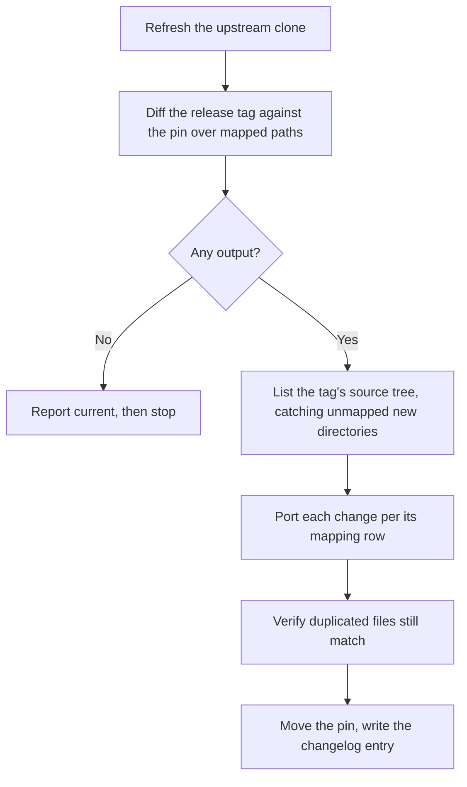

# Upstream sync

The port tracks a **pinned upstream commit**, recorded at the top of `UPSTREAM.md`. A sync
moves that pin forward and ports whatever changed in between. Everything about the process
exists to answer two questions cheaply: *what changed that matters here*, and *where does
each change land*.

## The mapping table is the contract

`UPSTREAM.md` maps upstream paths to the files in this repository they feed. A row is not
documentation — it is the decision about scope. If an upstream path has no row and is not on
the out-of-scope list, the mapping is incomplete and the next sync will miss it.

The mapping also records *how* each target is derived, which determines how a change
applies:

| Derivation | Applies as | Examples |
|---|---|---|
| Line-mapped verbatim | Near-direct diff | The two prompt reference files, the personal skill's authoring prompt |
| Adapted step | Rewrite, preserving the `[adapted]` note's shape | The deterministic lifecycle steps |
| Section-mapped / loose | Judgment | `openwiki-ask` |

Out of scope, and stated as such so an absence never reads as an oversight: authentication,
connector runtimes, schedulers, credentials and onboarding, the CLI's own command plumbing
and terminal UI, the interactive visualizer, telemetry, provider and transport
configuration, and the host installer.

## The procedure

The sync procedure, condensed from `UPSTREAM.md`.

The steps in words:

1. **Refresh a local upstream clone.** Unshallow it first if needed.
2. **List relevant changes** with a path-scoped `git log` from the pin to the new tag.
3. **No output → the skills are current; stop.** Output → review each commit's diff and
   port it per the mapping. Also list the tag's source tree and compare it against the
   mapping.
4. **Apply prompt changes as diffs**, keeping `[adapted]` and `[omitted]` markers intact.
5. **Verify the deliberately duplicated files still match.**
6. **Move the pin and write the changelog entry.**

## Guards, each earned by a real failure

These are not hypothetical precautions. Each one is in the procedure because a sync hit it.

**Diff against the release tag, not whatever `git pull` produces.** The local upstream
clone may sit on a fork branch. During the v0.4.0 sync a `git pull` advanced a fork feature
branch instead of upstream `main`, and the release tag did not even exist locally until it
was explicitly fetched. Resolve the tag, confirm it is a descendant of the pin, and diff
against it.

**List the tag's source tree, because a path-scoped `git log` is blind to new
directories.** Upstream 0.4.0 arrived partly as three whole new directories. A `git log`
over the *previous* mapping's paths could not have shown them — the prompt sources had moved
into files the mapping did not yet name. Comparing the tag's tree against the mapping is
what catches a relocation.

**Normalize template interpolation before reading a prompt diff.** When upstream extracts a
repeated literal into a constant, every line containing it shows as changed while the
rendered text is identical. Substituting the constants back before diffing separates a
mechanical refactor from a real prompt change.

**Diff the duplicated files.** The two `index-labels.md` copies must be byte-identical;
skills load per directory, so they cannot share one file. After any sync touching their
upstream source, update both and confirm the diff is empty.

**Check that a revert is complete.** A release can contain both a feature and its revert. If
so, the net effect is nothing — but confirm that by diffing the reverting commit against the
feature's parent rather than assuming it.

## What a sync must leave consistent

- The pin in `UPSTREAM.md`, the skill intro lines, and each reference file's provenance
  header all name the same upstream version.
- Every ported change is either unmarked verbatim text or carries a marker explaining the
  divergence. See [the port contract](../architecture/port-contract.md).
- Removed upstream behavior leaves no orphan references — a deleted prompt file, working
  file, or exclusion-list entry must disappear everywhere, including permission allowlists
  and reference-file cross-links.
- The changelog entry names both what was ported and what was deliberately skipped, with
  upstream PR numbers, so a later reader can tell a decision from an omission.

## When faithfulness and quality disagree

Upstream sometimes removes something the port still needs. The rule is to **follow upstream
and make the divergence visible**, not to quietly keep the old behavior.

The v0.4.0 sync has the clearest example: upstream stopped rendering its shared link-integrity
and diagram-discipline guidance into repository generation prompts, yet the deterministic
passes that stamp repair comments for both still run on every run. A stamped comment nobody
is instructed to repair is dead weight. The port therefore keeps a trimmed version of both
under an explicit `[omitted]` note, and `UPSTREAM.md` records that if upstream re-attaches
them, the note should be replaced with the verbatim text.

That is the shape to copy: reproduce upstream's decision, state the consequence, keep the
minimum needed to stop the artifact from degrading, and leave a note that says what to do
when upstream changes its mind.

## The OKF caveat

The port follows **upstream's code**, not the OKF specification or its announcement posts.
Where upstream has not implemented a spec feature, the port does not either — it does not
generate a `log.md` update history, even though reserved-file handling would tolerate one.
Divergence from the spec is upstream's to close; the port's job is to match upstream.
